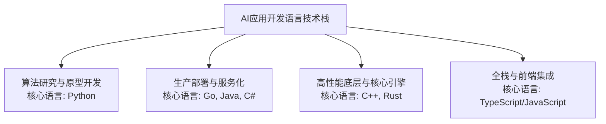

当前在AI应用开发领域，不同环节会选择不同的语言，没有唯一的“正确答案”。它们形成了一个各司其职的技术栈，从研究和原型到最终的生产部署，不同语言在效率和性能之间进行权衡。

下面这张图可以清晰地展示这个“AI语言技术栈”的全貌：

为了方便你选择，我把各个阶段的核心语言、主要特点及适用场景整理成了一个表格：

### 🛠️ 各阶段主流语言选型指南

| 开发阶段                    | 推荐语言                  | 核心特点与优势                                                                                                                                     | 典型应用场景                                                         |
| :-------------------------- | :------------------------ | :------------------------------------------------------------------------------------------------------------------------------------------------- | :------------------------------------------------------------------- |
| **🧠 算法研究与原型开发**   | **Python**                | 生态霸主，开发效率极高，拥有PyTorch、Transformers等无数AI库，是进行模型实验、数据分析和快速验证想法的首选。                                        | 训练大模型、构建RAG原型、数据分析、Prompt工程。                      |
| **⚙️ 生产部署与服务化**   | **Go、Java、C#**          | 主打高性能、高并发和强稳定性。能编译为高效二进制文件或运行在成熟的企业级虚拟机（JVM，.NET CLR）上，适合构建对外服务的API网关和高吞吐量的推理服务。 | 高并发的AI推理服务、微服务架构、企业级AI平台后端。                   |
| **🚀 高性能底层与核心引擎** | **C++、Rust**             | 追求极致性能，拥有精细的内存管理能力。几乎所有主流AI框架（如PyTorch、TensorFlow）的底层都由C++实现，是性能瓶颈的最佳解决方案。                     | 开发自定义CUDA算子、构建数据库或负载均衡器、为Python编写高性能扩展。 |
| **🌐 全栈与前端集成**       | **TypeScript/JavaScript** | Web开发的通用语言，借助Next.js、React等成熟框架，能轻松为AI应用构建管理后台、用户交互界面或浏览器插件。                                            | AI产品的Web前端、基于浏览器的AI应用、Node.js后端服务。               |

> 注：对于“约束编程”这种声明式范式，通常会使用Prolog等逻辑编程语言，并在特定领域被用于开发求解器。不过，在目前主流的AI应用开发中，这一范式相对边缘。

---

### 🤔 如何结合自身情况选择？

* **如果你是初学者或想做AI算法研究**：从 **Python** 开始准没错。它的学习曲线最平缓，能让你快速聚焦于AI模型本身，验证你的想法。
* **如果你要构建一个面向用户的高并发AI产品**：建议采用 **Python做算法 + Go/Java/C#做服务** 的混合架构。让Python负责复杂的模型推理，而由Go等服务负责接收海量用户请求，兼顾了算法效果和系统稳定性。
* **如果你希望拥有最广泛的技术适用性**：可以先深入掌握Python，并了解另一种语言（如Go或C#）用于后端开发，再对C++有所涉猎。这种组合能让你从数据到产品，从云端到硬件的各个层面都游刃有余。

理解了不同的技术栈，你是准备 **学习入门**，还是正在进行 **架构选型** 呢？告诉我你的具体目标，我可以提供更针对性的建议。
